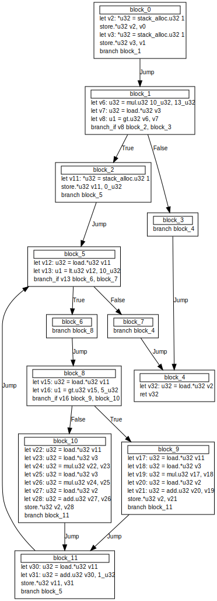
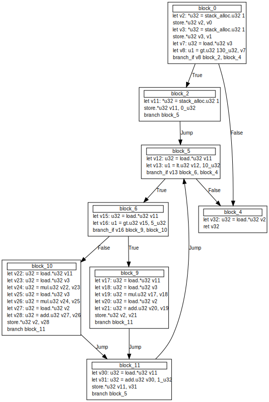

# About

A simple toy compiler project.

## How to build
To build this project, you'll need Rust version 1.72 or higher installed.

```
cargo build
```

## Frontend

This frontend uses a language syntax similar to Rust and follows the operator precedence of C++. 
The language was designed mainly to avoid having to generate an intermediate representation (IR) by hand. 
There's no semantic analysis incorporated; it relies on the assumption that the provided code is error-free. 
Parsing is done using a simple recursive descent parser.

Code:
```rs
fn test(a: u32, b: u32) -> u32 {
    if (10 * 13) > b {
        for i in 0..10 {
            if i > 5 {
                a += i * b;
            } else {
                a += i * b * b;
            }
        }
    }

    return a;
}
```

AST:
```rs
Function {
  name: "test",
  ty: Function {
    ret: Builtin(
      U32,
    ),
    params: [
      FunctionParam {
        name: "a",
        param_ref: Val,
        ty: Builtin(
          U32,
        ),
      },
      FunctionParam {
        name: "b",
        param_ref: Val,
        ty: Builtin(
          U32,
        ),
      },
    ],
  },
  body: Block {
    nodes: [
      If {
        condition: Binary {
          lhs: Binary {
            lhs: Literal(
              10,
            ),
            op: Mul,
            rhs: Literal(
              13,
            ),
          },
          op: Greater,
          rhs: Identifier {
            name: "b",
          },
        },
        on_true: Block {
          nodes: [
            For {
              value: Identifier {
                name: "i",
              },
              range: Range {
                from: Literal(
                  0,
                ),
                to: Literal(
                  10,
                ),
              },
              body: Block {
                nodes: [
                  If {
                    condition: Binary {
                      lhs: Identifier {
                        name: "i",
                      },
                      op: Greater,
                      rhs: Literal(
                        5,
                      ),
                    },
                    on_true: Block {
                      nodes: [
                        CompoundAssign {
                          dst: Identifier {
                            name: "a",
                          },
                          op: Add,
                          src: Binary {
                            lhs: Identifier {
                              name: "i",
                            },
                            op: Mul,
                            rhs: Identifier {
                              name: "b",
                            },
                          },
                        },
                      ],
                    },
                    on_false: Some(
                      Block {
                        nodes: [
                          CompoundAssign {
                            dst: Identifier {
                              name: "a",
                            },
                            op: Add,
                            src: Binary {
                              lhs: Binary {
                                lhs: Identifier {
                                  name: "i",
                                },
                                op: Mul,
                                rhs: Identifier {
                                  name: "b",
                                },
                              },
                              op: Mul,
                              rhs: Identifier {
                                name: "b",
                              },
                            },
                          },
                        ],
                      },
                    ),
                  },
                ],
              },
            },
          ],
        },
        on_false: None,
      },
      Return {
        expr: Some(
          Identifier {
            name: "a",
          },
        ),
      },
    ],
  },
}
```

## Backend
The compiler backend includes basic optimizations like constant folding, dead code elimination, and branch elimination.

The original, unoptimized code:




The control flow graph (CFG) after the currently implemented optimization passes:



